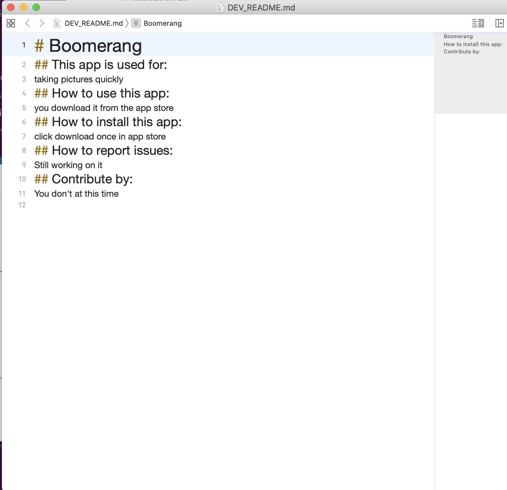

# Readme-Generator

Download from GitHub repo at https://github.com/Lesleyworden/Readme-Generator

To execute, open terminal and navigate to directory containing index.js  

Type "node index.js" to execute. This will require installation of node.js to provide runtime environment.

This application can be used for any application type. Once you run the program you follow the prompts. Provide information to populate the final .md file.

A video demonstration of this application:

https://drive.google.com/file/d/1GIppFpEkZr5JBlLm7jFDZdahORMbhWGM/view

;
